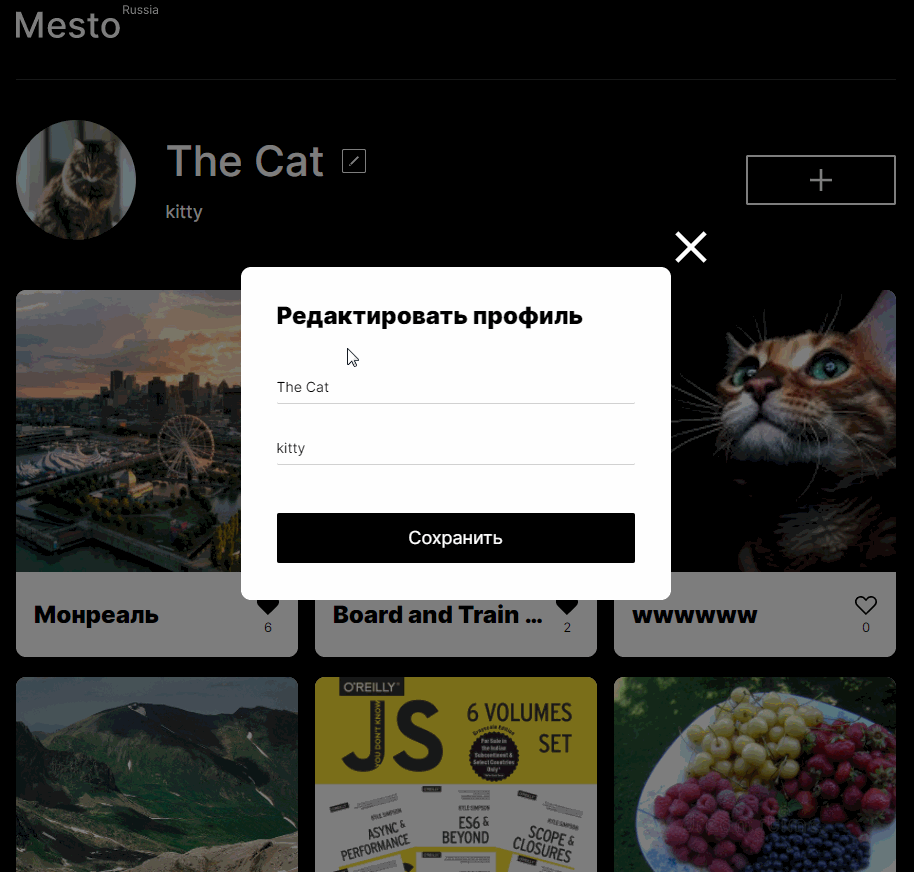

# Место

## Обзор

Проект на курсе Веб-разработчика в [Яндекс.Практикуме](https://practicum.yandex.ru) (4-9 спринты).

## Функциональность:
* Адаптивная верстка по макету из Фигмы
* Загрузка списка карточек мест с сервера по Api
* Добавление новой карточки в список
* Возможность ставить лайки карточкам
* Возможность удаления своей карточки
* Редактирование аватара пользователя и его краткой информации
* Просмотр фотографий мест в полном размере
* ООП при создании карточки, их добавлении в разметку, валидации форм и открытии попапов
* Реализация нескольких попапов на JS:
  - редактирования имени и био пользователя
  - добавления нового места в сетку карточек
  - открытия фотографии в большом размере.
  - обновление аватара пользователя
  - подтверждения удаления карточки  
* Валидация форм с помощью JS
* Закрытие попапов по нажатию Esc.
  
## Стек
* HTML
* CSS: flexbox, grid, animations, media queries
* JavaScript
* БЭМ
* Взаимодействие с Api через промисы
* ООП
* Npm
* Webpack
* Babel, PostCSS

## Посмотреть

[Ссылка на макет в Figma](https://www.figma.com/file/PSdQFRHoxXJFs2FH8IXViF/JavaScript.-Sprint-9?node-id=0%3A1)

Ссылка на Pages: [https://tropnikov.github.io/mesto](https://tropnikov.github.io/mesto/)

### Локальное демо

1. Клонировать репозиторий. 
2. Выполнить в директории репозитория
   
        npm i           
3. Запустить проект в браузере по умолчанию:
    
        npm run dev

Гифка с демонстрацией работы:

  
